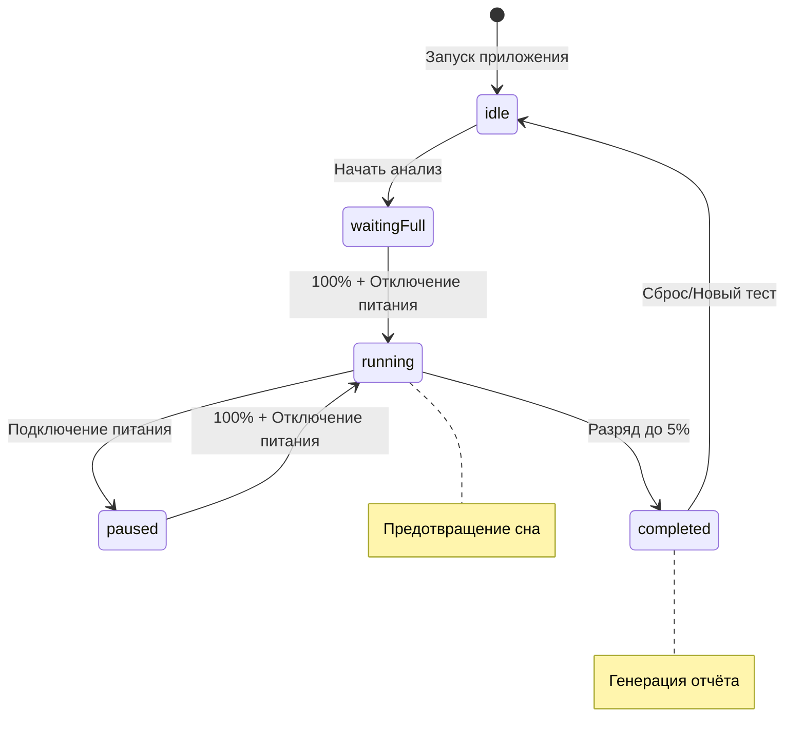

<div align="center">
  
</div>

Современное нативное меню-бар приложение для macOS, которое обеспечивает комплексный мониторинг состояния аккумулятора MacBook. Собирает детальную историю, визуализирует данные через интерактивные графики, выполняет углублённый анализ здоровья батареи и генерирует профессиональные HTML-отчёты.

## ✨ Основные возможности

### 📊 Мониторинг и аналитика
- **Детальные метрики**: Процент заряда, температура, напряжение, циклы зарядки, износ батареи
- **Интеллектуальная аналитика**: 
  - Средняя и трендовая скорость разряда (%/ч)
  - Прогноз времени автономной работы (100% → 0%)
  - Комплексная оценка здоровья батареи (0-100 баллов)
  - Детекция "микро-просадок" (резкие падения ≥2% за ≤120с)
  - Выявление аномалий и персонализированные рекомендации

### 🔬 Анализ автономности
- **Контролируемое тестирование**: Полный цикл разряда 100% → 5%
- **Автоматический запуск**: При достижении 100% заряда на батарее
- **Умная приостановка**: Автопауза при подключении зарядного устройства
- **История сессий**: Архив последних 5 тестов с возможностью сравнения
- **Защита от разрывов**: Автосброс при перерывах >5 минут

### 📈 Визуализация данных
- **Интерактивные графики**: Построены на Swift Charts с поддержкой zoom и hover
- **Временные ряды**: Заряд, температура, напряжение в реальном времени
- **Умное хранение**: 7 дней полной детализации, 7-30 дней агрегация, автоочистка >30 дней

### 📄 Профессиональная отчётность
- **HTML-отчёты**: Статические файлы с полным анализом состояния
- **SVG спарклайны**: Компактная визуализация трендов
- **Детальные таблицы**: Последние измерения с временными метками
- **Экспорт рекомендаций**: Готовые выводы для принятия решений

### 🌍 Локализация и доступность
- **Многоязычность**: Русский и английский интерфейс
- **Автоопределение**: Язык выбирается по системным настройкам
- **Режим без батареи**: Корректная работа на Mac mini/Studio
- **Полная автономность**: Работает офлайн, без сетевых запросов

## 🔧 Технические требования

| Компонент | Минимальные требования |
|-----------|----------------------|
| **macOS** | 13.0+ (Ventura) |
| **Xcode** | 15.0+ |
| **Swift** | 5.9+ |
| **Архитектура** | Apple Silicon / Intel |
| **Память** | 50MB RAM |
| **Место на диске** | 20MB |

## 🚀 Установка и запуск

### Сборка из исходников
```bash
# 1. Клонирование репозитория
git clone https://github.com/username/Battry.git
cd Battry

# 2. Открытие в Xcode
open Battry.xcodeproj

# 3. Сборка и запуск
# В Xcode: ⌘R или Product → Run
```

### Настройка проекта
1. Убедитесь, что целевая платформа установлена на macOS 13.0+
2. Выберите схему сборки (Debug/Release)
3. При первом запуске приложение появится в строке меню
4. Язык интерфейса определяется автоматически

### Развёртывание
- **Разработка**: Подпись кода не требуется
- **Дистрибуция**: Настройте Developer ID и Notarization для распространения

## 🏗️ Архитектура приложения

### Схема потоков данных
```
┌─────────┐    ┌───────────────┐    ┌──────────────┐    ┌─────────────┐
│  IOKit  │───▶│ BatteryService │───▶│ BatteryViewModel │───▶│ HistoryStore │
└─────────┘    └───────────────┘    └──────────────┘    └─────────────┘
                                            │                    │
                                            ▼                    ▼
                                   ┌─────────────────┐    ┌──────────────┐
                                   │ CalibrationEngine │    │ AnalyticsEngine │
                                   └─────────────────┘    └──────────────┘
                                            │                    │
                                            ▼                    ▼
                                      ┌──────────┐        ┌─────────────┐
                                      │ UI Panels │        │ HTML Reports │
                                      └──────────┘        └─────────────┘
```

### Ключевые компоненты

#### 🔋 Сбор данных о батарее
- **`BatteryService.swift`**: Низкоуровневый интерфейс IOKit
  - Чтение IOPowerSources и AppleSmartBattery
  - Обработка устройств без батареи
  - Валидация и нормализация данных

#### 📡 Управление состоянием
- **`BatteryViewModel.swift`**: Реактивная модель с опросом каждые 30 секунд
  - Публикация изменений через `@Published`
  - Форматирование для UI компонентов
  - `PassthroughSubject` для межкомпонентного взаимодействия

- **`HistoryStore.swift`**: Персистентное хранилище измерений
  - Путь: `~/Library/Application Support/Battry/history.json`
  - Интеллектуальное сжатие исторических данных
  - Миграция данных из старых версий

#### 🧠 Аналитические движки
- **`AnalyticsEngine.swift`**: Вычисление показателей здоровья
  - Линейная регрессия для трендов разряда
  - Медианная фильтрация данных
  - Скоринговая модель здоровья батареи
  - Алгоритмы детекции аномалий

- **`CalibrationEngine.swift`**: Управление тестовыми сессиями
  - Конечный автомат: `idle → waitingFull → running → completed`
  - Персистентность состояния в `calibration.json`
  - Предотвращение засыпания системы во время теста
  - Восстановление после прерываний

#### 🎨 Пользовательский интерфейс
- **`BattryApp.swift`**: Точка входа и инициализация MenuBarExtra
- **`MenuContent.swift`**: Табличный интерфейс с панелями
- **`ChartsPanel.swift`**: Визуализация через Swift Charts
- **`CalibrationPanel.swift`**: Контроль и отображение тестов
- **`SettingsPanel.swift`**: Информация о хранилище и настройки энергосбережения
- **`AboutPanel.swift`**: Информация о приложении и версии

#### 🗂️ Вспомогательные компоненты
- **`ReportGenerator.swift`**: Генерация HTML с встроенными SVG
- **`Localization.swift`**: Динамическое переключение языков

### Хранение данных
```
~/Library/Application Support/Battry/
├── history.json          # Временные ряды измерений
├── calibration.json      # Состояние и результаты тестов
└── [legacy migration]    # Миграция из BatMon

/tmp/
└── Battry_Report_*.html  # Временные отчёты
```

## 📊 Алгоритмы аналитики

### Оценка здоровья батареи
Интегральный показатель рассчитывается по формуле:
```
HealthScore = 100 - (WearPenalty + CyclePenalty + TempPenalty + MicroDropPenalty)

где:
- WearPenalty = min(wearPercent, 40)
- CyclePenalty = max(0, (cycles - 500) / 20)
- TempPenalty = max(0, (temperature - 40) * 2)
- MicroDropPenalty = microDropEvents * 5
```

### Детекция микро-просадок
Алгоритм анализирует окна по 4 измерения (120 секунд) и выявляет:
- Падение заряда ≥2% при отключённом питании
- Отсутствие процесса зарядки
- Валидные временные метки

### Прогнозирование автономности
- **Простое усреднение**: Среднее арифметическое скорости разряда
- **Трендовый анализ**: Линейная регрессия методом наименьших квадратов
- **Адаптивное окно**: Минимум 4 точки для статистической значимости

## 🔄 Жизненный цикл калибровки



## 🛠️ Стиль разработки

### Принципы кодирования
- **Чистая архитектура**: Разделение на слои без смешивания ответственности
- **Реактивное программирование**: Combine + SwiftUI для связывания данных
- **Нулевые зависимости**: Только системные фреймворки (SwiftUI, IOKit, Foundation)
- **Типобезопасность**: Строгая типизация и обработка ошибок

### Соглашения
- **Локализация**: Все пользовательские строки через `Localizable.strings`
- **Персистентность**: JSON для сериализации состояния
- **Логирование**: Минимальное, только критические ошибки
- **Тестирование**: Ручное на реальном оборудовании

## 🐛 Известные ограничения

### Аппаратные ограничения
- **Детекция UPS**: Возможны ложные срабатывания при подключённых ИБП
- **Сенсоры**: Температура/напряжение недоступны на некоторых моделях
- **Точность IOKit**: Нестабильность TimeToFull/TimeToEmpty на старых системах

### Алгоритмические ограничения
- **Регрессионный анализ**: Требует ≥4 точек для достоверности
- **Микро-просадки**: Возможны ложные срабатывания на зашумлённых данных
- **Статистическая значимость**: Короткие сессии могут давать неточные оценки

### Системные ограничения
- **Устройства без батареи**: Ограниченная функциональность на Mac mini/Studio
- **Разрывы данных**: Автосброс калибровки при перерывах >5 минут
- **Приостановка системы**: Может влиять на непрерывность сбора данных

## 🚀 Планы развития

### Краткосрочные цели
- [ ] **Настраиваемые интервалы опроса**: 10/30/60 секунд
- [ ] **Push-уведомления**: Критическая температура, аномалии
- [ ] **Экспорт данных**: CSV/JSON для внешнего анализа
- [ ] **Темы оформления**: Тёмная/светлая тема, кастомизация

### Среднесрочные планы
- [ ] **Профили устройств**: Поддержка нескольких MacBook
- [ ] **Настраиваемые пороги**: Пользовательские лимиты для алертов
- [ ] **Интеграция с Shortcuts**: Автоматизация через macOS Shortcuts
- [ ] **Автозапуск**: Встроенная настройка Login Items

### Долгосрочная перспектива
- [ ] **Машинное обучение**: Персонализированные прогнозы
- [ ] **Сравнительная аналитика**: Бенчмарки по моделям устройств
- [ ] **API для разработчиков**: Интеграция с внешними инструментами
- [ ] **Облачная синхронизация**: Опциональный бэкап данных (с шифрованием)

## 🔒 Конфиденциальность и безопасность

### Принципы Privacy by Design
- **Локальная обработка**: Все данные остаются на устройстве
- **Нулевая телеметрия**: Отсутствие сбора аналитики или отчётов об ошибках
- **Прозрачное хранение**: Открытые форматы JSON для всех данных
- **Контроль пользователя**: Полный доступ к экспорту и удалению данных

### Безопасность данных
- **Sandbox**: Приложение изолировано системными ограничениями macOS
- **Минимальные разрешения**: Доступ только к необходимым системным API
- **Открытый код**: Возможность аудита безопасности сообществом

## 🤝 Участие в разработке

### Процесс внесения изменений
1. **Fork** репозитория
2. **Создание feature branch**: `git checkout -b feature/amazing-feature`
3. **Коммит изменений**: `git commit -m 'Add amazing feature'`
4. **Push в branch**: `git push origin feature/amazing-feature`
5. **Создание Pull Request** с детальным описанием

### Критерии приёмки
- ✅ Соответствие архитектурным принципам
- ✅ Покрытие новой функциональности тестами
- ✅ Обновление документации при необходимости
- ✅ Совместимость с минимальными требованиями
- ✅ Отсутствие внешних зависимостей без обоснования

### Обратная связь
- 🐛 **Issues**: Для сообщений об ошибках и предложений
- 💬 **Discussions**: Для обсуждения архитектурных решений
- 📧 **Security**: Для конфиденциальных вопросов безопасности

## 📜 Лицензия

**MIT License** - подробности в файле [LICENSE](LICENSE)

---

<div align="center">
  <strong>Разработано с ❤️ для macOS сообщества</strong><br/>
  Ваши идеи и предложения помогают делать Battry лучше!
</div>